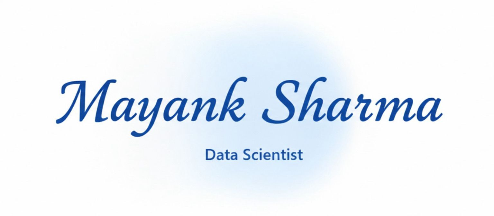

  

<!-- SMOOTH PROFESSIONAL TYPING -->

  

<!-- SUBTLE GLASS DIVIDER -->

  

<!-- SOFT STATUS BADGES -->

  <!-- LinkedIn -->
  

  <!-- GitHub -->
  

  <!-- Email -->
  

<!-- SUBTLE GLASS DIVIDER -->

  

<table border="0">
  <tr>
    <td width="60%" valign="top">
      <h2> About Me</h2>
      

        I am an aspiring <b>Data Scientist</b> with a strong foundation in 
        <b>Machine Learning</b> and <b>Data Analysis</b>. My core interest lies in 
        <b>NLP</b> and <b>Deep Learning</b>, building models that interpret human text.
      

      

        I am passionate about solving real-world problems by extracting 
        insights from complex datasets using <b>Python</b> and modern libraries.
      

      

        Currently, I am focusing on refining my <b>Deep Learning</b> skills. 
        I am always open to collaborating on innovative data-driven projects!
      

    </td>
    <td width="40%" align="center" valign="middle">
      
    </td>
  </tr>
</table>

<!-- SUBTLE GLASS DIVIDER -->

  

## 🌐 My Portfolio Showcase

  
    <b>Click the image above to visit my live portfolio!</b>
  

<!-- SUBTLE GLASS DIVIDER -->

  

## 🧠 What I Work With

- 📊 Data Analysis & Feature Engineering  
- 🤖 Machine Learning Models  
- 🧠 NLP & Text Understanding  
- 🧪 Experimentation & Evaluation  
- 🚀 Deployable ML Apps (Streamlit)  

<!-- SUBTLE GLASS DIVIDER -->

  

## 🛠 Skills & Tech Stack

| Programming & Analysis | Machine Learning | Deep Learning & NLP | Visualization & Tools |
| :---: | :---: | :---: | :---: |
|  **Python** |  **Scikit-Learn** |  **TensorFlow** |  **Matplotlib** |
|  **SQL** |  **Pandas** |  **PyTorch** |  **Seaborn** |
|  **Statistics** |  **NumPy** |  **Hugging Face** |  **Power BI** |
|  **Data Analysis** |  **Jupyter** |  **NLP (NLTK/Spacy)** |  **Git** |

<!-- SUBTLE GLASS DIVIDER -->

  

  
  
    

  
  
    

  

>

<!-- LIGHT FOOTER WAVE -->

  

